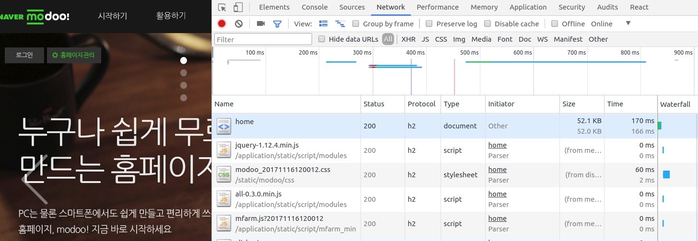

<!-- $theme: gaia -->

# HTTP/2 세대의 Java

###### 정상혁
---

## 발표자 소개
- KSUG 3기 일꾼단 활동
- [네이버 PaaS](http://recruit.navercorp.com/naver/job/detail/developer?annoId=20001224&classId=&jobId=&entTypeCd=&searchTxt=API) 소속
- 하는 일
	- 협업 플랫폼 개발
	- 사내 공통 프레임워크 기술 지원
	- 네이버 개발자센터(developers.naver.com) 개선
- 네이버 기술 블로그 (d2.naver.com) 에 가끔 기고


---

## HTTP/2 세대의 이상

---
### HTTP/2 ?
- HTTP/2 시대는 이미 와있다.


----


---


---



---

- 2015년 5월 RFC 7240 스펙 공표

> Idea was to maintain HTTP semantics but change how it is transported.
>
> Daniel Stenberg ( curl 개발자)


---

### 특징
- Binary protocol

#### 데이터 전송 단위
- Stream
	- 하나의 H2 연결은 여러개의 Stream을 동시에 열어둘 수 있음.
- Frame
	- Stream 내부의 전송 단위 

---

#### 연결 지속
> Servers are encouraged to maintain open connections for as long as possible but are permitted to terminate idle connections if necessary.
> 
> https://http2.github.io/http2-spec/#rfc.section.9.1 참조

- 기존 Keep-Alive 관련 헤더들은 무시됨.

```
Keep-Alive: timeout=5, max=99
Connection: Keep-Alive
```

---

#### 헤더
- Pseudo-header 필드
	- HTTP/1.1 에서는 메시지 시작줄에 표시하던 정보  
	- ':'로 시작 
	- `:status`, `:authority`, `:scheme`, `method` , `:path`
- https://http2.github.io/http2-spec/#HttpHeaders 참조
---

#### HTTP 1.1 을 계승했지만 다른 프로토콜

- 1.1로 요청이 오면 응답 코드 101을 내릴 수 있다.
	- https://http2.github.io/http2-spec/#discover-http 참조
```
HTTP/1.1 101 Switching Protocols
Connection: Upgrade
Upgrade: h2c
```

---

### 익숙해질 용어
- h2 : HTTP/2 (with TLS)
	- 웹브라우져와 서버간의 통신
- h2c : Clear text HTTP2/ (without TLS)
	- Server to Server 연결
	- 지원하는 웹브라우져는 없음
- ALPN : Application-Layer Protocol Negotiation
	- 프로토콜 협상을 위한 TLS 확장
	- h2 연결에 필요

---

### 왜 HTTP/2 로 가는가?

더 나은 성능

- 헤더 압축
- Multiplexing
	- 하나의 TCP 커넥션으로 여러 요청을 동시에 전송
-  Server push
	- 연관된 자원을 서버에서 밀어줌
	- 예) HTML에서 참조할 이미지를 HTML 요청 시점에 전송

---

- 성능 체감 Demo
	- http://www.httpvshttps.com/


### 기대!?
- .js, 이미지 파일 안 합쳐도 된다?
	- 더 효율적인 파일별 캐쉬
	- 빨리지는 FE 빌드
- Server push로 한 페이지에 필요한 자원은 미리 전송
	- 더 이상의 계단 그래프는 없다?

---

## Java 생태계의 HTTP/2 지원

---

###  Servlet 4.0 : Server push
- Tomcat 9, Jetty 10에서 지원

```java

@RestController
public class HomeController{
	@GetMapping("/")
    String home(PushBuilder pushBuilder) {
		pushBuilder
                .path("h2-1.jpg")
                .addHeader("content-type", "image/png")
                .push(); 
		return "index";;
	}
}

```

----

### Java9 : HttpClient

```java
HttpClient httpClient = HttpClient.newHttpClient();
HttpRequest request = HttpRequest.newBuilder(URI.create("https://h2demo"))
                .version(HttpClient.Version.HTTP_2)
                .GET().build();
HttpResponse<String> response = httpClient.send(request, HttpResponse.BodyHandler.asString());
System.out.println(response.headers().map());
System.out.println(response.body());
```

---

### Java9 : ALPN 지원
- Java 서버에서 TLS offloading을 할 때 사용
- [JEP-244](http://openjdk.java.net/jeps/244)
- Java7,8에서 ALPN을 쓰려면?
	- [jetty-alpn-agent](https://github.com/jetty-project/jetty-alpn-agent) 활용 가능

---

### 이상적인 서버 구성

레거시의 전형적인 구성


---

h2시대의 이상적인 구성

- Java 단에서 TLS처리는 느림
	- 그 앞단에서 TLS는 벗겨내는 것이 좋음 
- Fron Web server - Backend App 서버 간에는 h2c 활용
	- 프로토콜 전환 비용 최소화


---

### 이상적인 클라이언트
- 레거시 코드에서 1~2줄만 바꿔주면 바로 HTTP/2로 통신

---


## 현실의 난관

---

### Demo
- Nginx + Tomcat으로 h2 서버 구성
- 크롬 개발자 탭 (Ctrl + Shift + i)
- HTTP/2 세션 페이지 ( chrome://net-internals/#http2 )
- Jshell + HttpClient로 호출 테스트
- tshark로 Upstream 연결 확인
	- `tshark -i lo -f 'tcp port 8080' -T fields -e _ws.col.Protocol -e _ws.col.Info`
- Server push 시도

---

demo는

- 뒷단은 HTTP 1.1 연결
- Servlet4.0의 Server push 안 먹힘

---

### Front 웹서버의 제약
- Apache httpd :  2.4.17 이후 h2 지원
 	- [2.4.26 버전까지는 crash 사례가 알려짐](https://icing.github.io/mod_h2/fuzzing.html)
	- [2.4.27 이후로 prefork 모드에서 http2_module 사용 불가](http://www.apache.org/dist/httpd/CHANGES_2.4.27)

사용하는 Apache 모듈이 멀티스레드에서 안전한지 확신이 없어서 prefork mode를 실무에서는 많이 씀

- prefork mode : 연결 1개당 1개의 프로세스
- worker mode :  연결 1개당 1개의 스레드

---

- 안정화 되더라도 Apache httpd가 h2에 어울릴지는 의문
	- 연결당 자원소모가큰 구조.
	- Event MPM이 있자만 Nginx보다 성능에서 뒤지는 것으로 나옴. (Appendix 참조)

---

- Nginx : 1.9.5이상에서 HTTP/2 지원
	- [1.9.9 미만에서는 upstream으로의HTTP/1.1 연결에 버그가 있었음](https://trac.nginx.org/nginx/changeset/78b4e10b4367b31367aad3c83c9c3acdd42397c4/nginx/)
	- 서버저 push 지원 안 함
	- Upstream (Backend server) 연결에 h2c를 지원안함
    	- 아직 구체적인 계획 없음
		- Server to server 연결에서는 http/1.1로도 충분하고 인식하고 있음 (http://mailman.nginx.org/pipermail/nginx/2015-December/049445.html 참조)

---

### 어플리케이션 서버의 제약
- Tomcat 9은 아직 Beta
- Jetty 10은 아직 Snapshot
- AJP로는 서버 Push가 지원되지 않음.
- Java 단에서 TLS offloading 했을 때의 느린 성능
	- [Java단에서 27ms걸리는데 HAProxy에서하면 3.2ms가 걸렸다는 사례도 있음.](https://vanwilgenburg.wordpress.com/2017/01/10/haproxy-with-undertow-and-tomcat-in-spring-boot/)
---

### Java9 업그레이드의 어려움
- 3rd party 라이브러리에서 Java9 지원이 불안정한 경우가 있음
	- 예) Lombok 
- JDK의 모듈화로 인환 추가 작업

---
예) JAXB 모듈을 쓰기 위해서는 모듈과 관련된 추가 선언이 필요함.

```
<plugin>
	<artifactId>maven-compiler-plugin</artifactId>
	<version>3.7.0</version>
	<configuration>
		<compilerArgs>
			<arg>--add-modules</arg>
			<arg>java.xml.bind</arg>
		</compilerArgs>
	</configuration>
</plugin>
```

관련된 선언이 없으면 'package javax.xml.bind.annotation is not visible' 에러

---

### Client 라이브러리의 미성숙
- Java9의 jdk.incubator.http.HttpClient
	- 아직 incubator
	- Java10(2018?) 이후에 java.httpclient로 정식 포함.
	- 하위호환성 깰수도 있음.

---

### 정리
- Apache httpd는 지속적 연결에 불리하고, 실행모드를 바꾸기에는 리스크가 있음.
- Nginx는 server push를 못쓴다.
- Java단에서 TLS off loading하면 느림.
- 안정된 구성은
	- Server push 포기
	- Nginx -(http/1.1)- Tomcat 구성

---

- 어짜피 Server push 못 쓰니
	- h2를 위해 Tomcat 9, Spring 5 올릴 필요 없다.
- Java9 클라이언트
	- 인큐베이터이니 테스트 정도만?
- 내부망에서는 Server to Server 연결에서 굳이 h2(with TLS)를 써야하는지도 의문


---

- HTTP/2 시대에 대비하는 생계형 Java 개발자의 자세
	- HTTPS 전환, Nginx 사용
	- 이미 Nginx + HTTPS 쓰고 있다면 : Nginx 설정 한 줄 바꾸기
	- Servlet 4.0, Java9 Client 스펙은 아직 신경 쓰지 않아도 됨.


---

---

### 감사합니다

---

늘 그랬듯이 길을 찾기


---

### Demo 2

- Nginx + Tomcat으로 h2/http1.2 서버구성
	- 크롬으로 H2 연결 확인
	- tshark로 뒷단의 연결 확인
- HA proxy + Tomcat으로 h2/h2c 서버구성 
- Server push
- JDK9 HttpClient 로 요청
- OkHttp 로 요청

---

## 현실 적용

---

### Server push를 포기하고 친숙한 구성
- 앞단에 Nginx
	- h2는 persistent connection이기 때문에 Nginx가 유리
- Upstream 서버는 HTTP 1.1 시대와 동일하게 하면 됨
- 첫번째 Demo와 유사한 구성

---
첫 번째 demo와 유사한 구성


---
뒷단 서버의 구성 건드리지 않고 HAProxy만 추가해서도 가능


---

#### Server push를 지원하는 서버 구성
- HAProxy -> Tomcat 바로 연결
	- Demo2와 같은 구성


---

- L4 Switch -> Tomcat
	- TLS offloading은 [Forked Tomcat native](http://netty.io/wiki/forked-tomcat-native.html) 로


---
- 기존 서버 구성과 달라려서 고민해봐야할것
	- Health check 방식
	- 배포 시 서버를 제외하는 방식

---

### 클라이언트 모듈 선택
- 내부망에서의 호출은 HTTP 1.1로 충분할 수 있음.
 	- OkHttp도 아직 h2c 미지원 
- 외부 서버와 HTTPS + HTTP/2 호출을 해야한다면
	- 현시점에서는 OkHttp 추천

---
RestTemplate + OkHttp3

```java
OkHttp3ClientHttpRequestFactory requestFactory = new OkHttp3ClientHttpRequestFactory();

RestTemplate restTemplate = new RestTemplate(requestFactory);
ResponseEntity<String> response = restTemplate.getForEntity("https://www.naver.com", String.class);
System.out.print(response.getHeaders());
System.out.println(response.getBody());
```

---

## 향후 과제

---

### Server push의 최적 활용 방식 찾기
- 무작정 쓴다고 이득이 되는것은 아니다.
- 예) 쿠키를 검사해서 신규 방문자일때만 push
- [Rules of Thumb for HTTP/2 Push](https://docs.google.com/document/d/1K0NykTXBbbbTlv60t5MyJvXjqKGsCVNYHyLEXIxYMv0/edit) 참조
- Cache 되지 않은 파일만 push하는 스펙도 제안 중
	- https://tools.ietf.org/html/draft-ietf-httpbis-cache-digest-02

 
---

### 프레임워크 지원
- Jetty의 [PushCacheFilter](https://github.com/eclipse/jetty.project/blob/jetty-9.4.x/jetty-servlets/src/main/java/org/eclipse/jetty/servlets/PushCacheFilter.java#L293)
	- 연관된 자원의 push를 자동으로 알아서

---

## 정리
---
- HTTP/2 서버 시대를 맞이하는 2개의 길
	- 길1: 기존에 익숙한 서버 구성을 쓰고 Server push를 포기하기
		- 충분히 좋은 선택일수도 있다.
		- 이 길에서도 Apache httpd + AJP의 시대는 지나가고 있을지도 모른다.
	- 길2: Server push의 쓰임새를 찾아보기
		- 기존과 서버 구성이 많이 바뀔 수 있다. 

---

- 클라이언트 : 더 더양한 프로그램밍 모델, 라이브러리가 난립하는 시대.
	- Spring 내에서도 RestTemplate, AsyncRestTemplate, WebClient
	- HTTP/2지원 여부까지 포함하면 경우의 수가 더 많아짐. 
	- 다양한 시도와 공유가 필요.

---
- 아직까지 기회의 땅
	- 수치화될수 있는 성과
	- Framework 지원이나 사용 패턴에 있어서 새로운 아이디어가 나올 여지가 큼


---
#### 바이너리 웹 세대
- 바이러리 실행 코드(Web asssemble) + 바이너리 프로토콜(h2)
- 어플리케이션 실행 플랫폼으로서의 최적화된 웹
- 브라우저 위에서 바이너리 RPC 프로토콜을 실행할 수 있는 여지도 커짐
	- 예) [browser-thrift](https://www.npmjs.com/package/browser-thrift), [grpc-web-client](https://www.npmjs.com/package/grpc-web-client)
	- 게임, 지도 등 고성능이 필요한 클라이언트 환경에서 고려해볼만
	- Web API 형식의 다양화를 이끌지 않을까?

---

## Appendix

---

### Apache Event MPM vs Nginx 비교 사례
Nginx쪽의 응답시간/처리량이 모두 좋게 나옴.
- (2014년) http://www.eschrade.com/page/performance-of-apache-2-4-with-the-event-mpm-compared-to-nginx/
- (2013년) http://www.mimul.com/pebble/default/2013/04/11/1365675641729.html
- (2013년) https://www.nidc.kr/customer/content.asp?board=tec&uid=994&board_group=0&params=page=9

---

event mpm의 한계
- worker MPM 을 바탕으로 하기 있기 때문에 context switching이 발생하는 구조
    - event driven을 근본적인 설계에 담은 Nginx와는 다름.
- mod_gzip , mod_ssl 등의 모듈 때문에 blocking 되는 구간이 생김

( https://stackoverflow.com/questions/27856231/why-is-the-apache-event-mpm-performing-poorly )

---
### AJP의 server push 미지원

- AjpProcessor의 상위 클래스인 [AbstractProcessor](https://github.com/apache/tomcat/blob/trunk/java/org/apache/coyote/AbstractProcessor.java#L775) 에서 doPush() 메서드는 UnSupportedOperationException을 던지고 있음.
- AjpProcessor 에서는 이를 특별히 override하지 않고 있음.
- h2c연결에 쓰이는 [StreamProcessor](https://github.com/apache/tomcat/blob/trunk/java/org/apache/coyote/http2/StreamProcessor.java#L209) 에서는 doPush() 메서드가 구현되어 있음.